# Quiz - Fun 
Quiz - Fun is a website that utilizes JavaScript to host short quizzes on a variety of subjects. Currently it has one quiz about the American NFL football team, the Pittsburgh Steelers. The goal of Quiz - Fun is to provide users with fun, short quizzes on a variety of subjects. The look is simple, and it easy to navigate. Quiz - Fun has room to grow by adding more subjects.

## Mockups

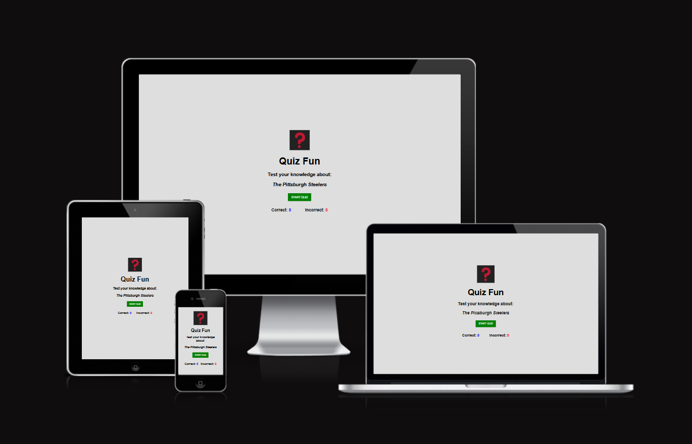 

## Color Scheme
The color scheme for Quiz - Fun is clean and simple, a light gray background on the opening page and buttons and messages are in primary colors.  The logo is a red question mark on a black background.
* rgb(235, 233, 233) is the background color for the opening page
* #000000 (black) is used for the opening page and question text
* #ffffff (white) is used for the navigation and links on the header and footer
* #008000 (green)is used for the background color of the start button, the answer choice buttons and the start-again buttons.
* #373636 (dark gray) is used for the next button to differntiate it with green answer choice buttons
* #ff0000 (red) is used to show the INCORRECT! message and the incorrect score number
* #ffff00 (blue) is used to show the CORRECT! message and the correct score number

## Typography
Quiz-Fun uses one font, Poppins, utilizing Poppins at a different weights for the title, button text, questions and scores. Poppins italic at a smaller size was used for the source text that displays at the bottom of the page for each question. 

## Wireframe
| Description | Image       | 
|------------ | ----------- |
| The original design of Quiz - Fun was going to utilize an image to display the question next to the buttons for answer choices. The final design did not use images so that it would be easier to add more subjects.  Also the centered design makes the site easily responsive, with only a few size changes in media queries for smaller screens. | 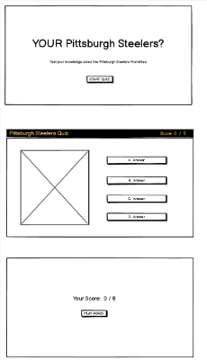 |

## Features
### Existing

| Feature | Description | Screenshot  | Screenshot  |
|-------- | ----------- | ---------- | ---------- |
| Favicon | Quiz - Fun has a custom favicon that featuers of bold red question mark on a blackground. It displays next to the page title in the browser tab. |  |
|Landing Page | The landing page is very straightforward, it shows the subject of the quiz with a green start button to start. As quiz subjects are added, the landing page will display button choices of subjects first, that on click, will take the user to the landing page for that quiz.| 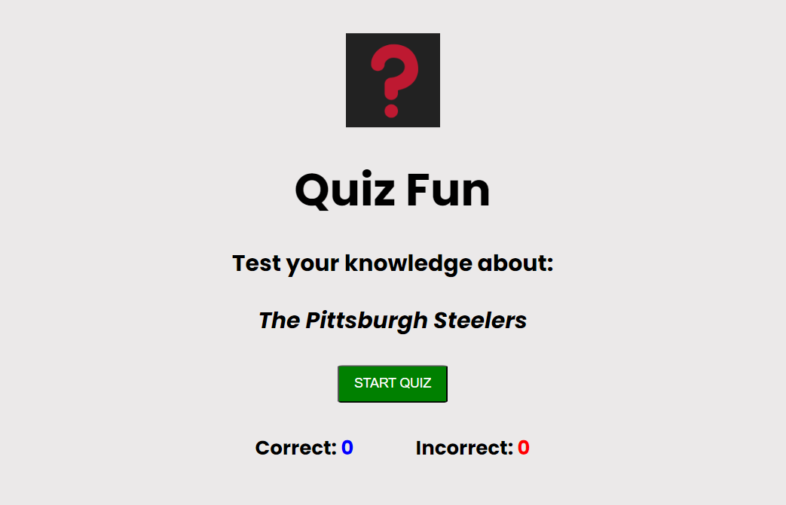 | 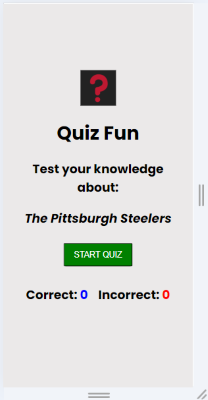
|Quiz Subject | The subject of the quiz is displayed in italics and as quiz subjects are added, the subject will be displayed when the correcsponding button is clicked| 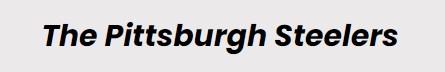 | 
| Start Button | On click of the this button starts the quiz | 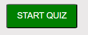 |  
| Quiz question | On click of the start button takes the user to the first question of the quiz.  The quiz question is black bold text at the top and the answer choices are in green stacked vertically. The answer choices are populated randomly so if you run the quiz again, the answers will be in different button positions. There is a sentence that instructs the user how to play, it displays on this page only. | 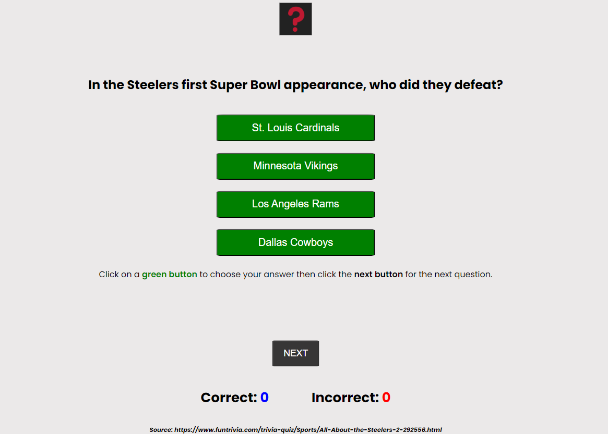 | 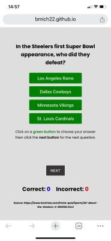 |
| Choice Buttons | The user must click on one of the green answer choice buttons. On click of the button, a result will show either CORRECT! in red, or INCORRECT! in blue. The button that was chosen will change color to red or blue, whether it was the correct choice or not. Also, the coice button will be disabled after the choice is made so the user cannot keep clicking on them.| 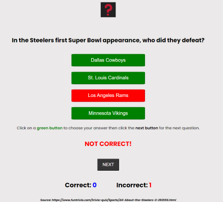 | 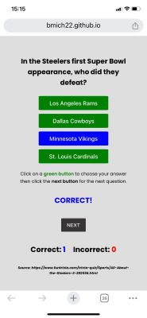 |
| Next Button | The user clicks next to display the next question. The choice buttons all turn back to green and become active again.  The next button is disabled until an answer is clicked.| 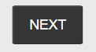 
| Score area | The correct and incorrect scores are incremented with each question and are displayed underneath the next button. Correct scores are displayed in blue, incorrect scores are displayed in red. | 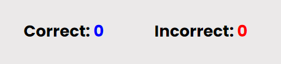 
| Source | The source for each question is displayed at the bottom of the page in italic, smaller size text. |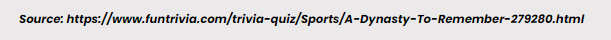 |
|Final Score | Once the array of questions is finished, the click on the next button will take the user to the Final Score page that displays the total correct answers out of the total number of questions.| 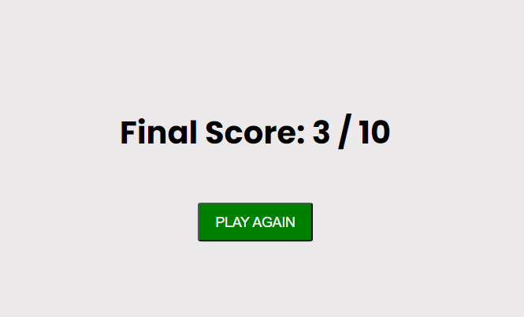 |
|Play Again Button | On click of the play again button, the page will be refreshed and the user can start the quiz again.  | 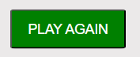

### Future Features
Quiz - Fun has room to grow
* Add quiz subjects
* Add more questions to the question array and have them display randomly so no quizzes on one subject will be exactly the same
* Add a timer to the quiz
* Monetize by displaying ads

## Tools and Technologies Used

* HTML used for the main site
* CSS used to style the design of the main site
* JavaScript was used for: start the quiz with the onclick method on the start button to call a function in JS to run the quiz; using a loop to rotate through the question array; using a loop to randomly display the answer choices in the buttons; using the onclick method on the next button to activate and disable buttons so the user cannot enter a second choice or click ‘next’ without first answering, and, ready the html for the new question content; ending the quiz and displaying a final score; using the onclick method on the ‘play again’ button to refresh the page and start again from the beginning.
* Github used to store code online
* Gitpod used for IDE (development environment)
* Canva.com used to create the favicon for Quiz - Fun
* Google Fonts used to add Poppins font to Quiz - Fun

### Validator Testing

| Page | Language | Validator | Outcome |
| ---- | -------- | --------- | ------- |
| index.html | HTML |[The W3 Markup Validation Service]() | No errors found. |
| thank-you.html | HTML |[The W3 Markup Validation Service](https://validator.w3.org/nu/?doc=https%3A%2F%2Fbmich22.github.io%2Ffitness-coach%2Fthank-you.html) | No errors found. |
| style.css | CSS | [The W3 CSS Validation Service](https://jigsaw.w3.org/css-validator/validator?uri=https%3A%2F%2F8000-bmich22-fitnesscoach-6om28dv68cc.ws-eu110.gitpod.io%2Fassets%2Fcss%2Fstyle.css&profile=css3svg&usermedium=all&warning=1&vextwarning=&lang=en) | No errors found. |

## Unfixed Bugs
There are no unfixed bugs.

## Deployment
The site was deployed to GitHub Pages with the following steps:
1. Go to Settings in the GitHub Repository
1. In the left-hand side bar, click on Pages
1. Under Build and Deployment - Source, click on the drop-down menu and select Deploy from a Branch
1. Under Branch, click on the drop-down menu and select Main
1. Next to main, click on the drop-down menu and choose the folder root
1. Under Branch, click Save
1. Wait a few minutes and refresh the page. When the site is live, you will have a message at the top of the page, Your site is live with a link to the page.

The live link can be found here: https://bmich22.github.io/fitness-coach

## Credits
The following are sources of information used in building Jane Smith Fitness Coach.

### Content, Code and Media
| Source | Location | Notes |
| ------ | -------- | ----- |
| [Freepik.com](https://www.freepik.com/free-photo/fitness-woman-workout_7135725.htm#fromView=search&page=1&position=50&uuid=dc72e9bc-7936-40af-8fe1-e4e2d880d947) | Intro section | Image |
| [Freepik.com](https://www.freepik.com/free-photo/women-working-out-with-trainer_6265274.htm#fromView=search&page=1&position=31&uuid=74944cf4-5462-46d6-a2be-f4b4b246a365) | About Jane section | Image |
| [Webdev Simplified](https://youtu.be/fYq5PXgSsbE?si=T-L7xfA9toAmR3PZ) | Main section | Flexbox |
| [CSS-Tricks](https://css-tricks.com/snippets/css/a-guide-to-flexbox/#aa-background) | Main Section | Flexbox |
| [Divya Thakur](https://www.youtube.com/watch?v=MCo1UtflJHM) | README | General how-to information |
| [Github](https://docs.github.com/en/get-started/writing-on-github/getting-started-with-writing-and-formatting-on-github/basic-writing-and-formatting-syntax#links) | README | Basic Formatting Syntax |
| [Github](https://docs.github.com/en/get-started/writing-on-github/working-with-advanced-formatting/organizing-information-with-tables) | README | Organized Data with Tables |
| [Shay Howe](https://learn.shayhowe.com/html-css/writing-your-best-code/) | index.html and style.css | Coding Practices |
| [Chris Quinn, Mentor](https://github.com/10xOXR) | HTML | Smooth Scrolling and "defer" when putting a script in the head |

### Acknowledgements
* Thank you to [Chris Quinn](https://github.com/10xOXR), my mentor at Code Institute.
* Thank you to [Code Institute](https://codeinstitute.net/de/) for all of the instructional content that was needed to create this project.

