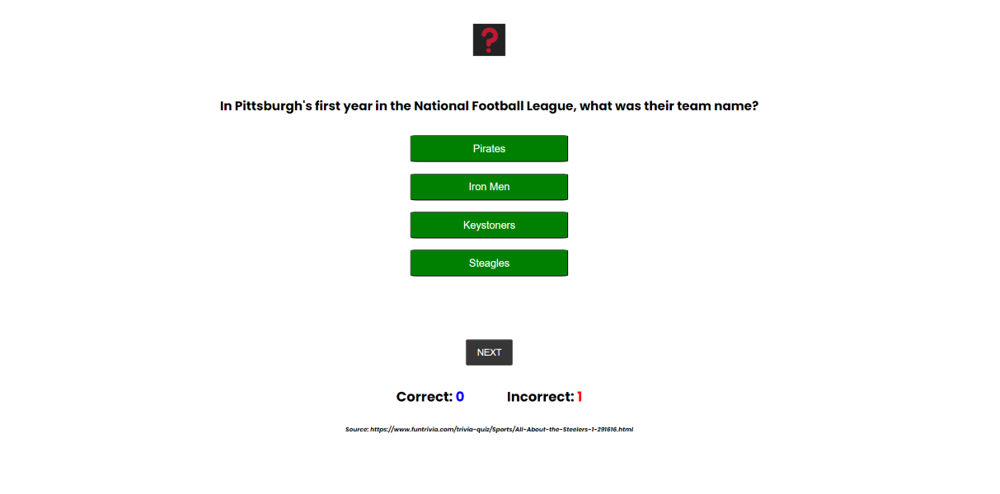

# Quiz - Fun 
Quiz - Fun is a website that utilizes JavaScript to host short quizzes on a variety of subjects. Currently it has one quiz about the American NFL football team, the Pittsburgh Steelers. The goal of Quiz - Fun is to provide users with fun, short quizzes on a variety of subjects. The look is simple, it easy to navigate and fully responsive. Quiz - Fun has room to grow by adding more subjects, more difficulty and a timer.

## Mockups

 

## Color Scheme
The color scheme for Quiz - Fun is clean and simple, a light gray background on the opening page and buttons and messages are in primary colors.  The logo is a red question mark on a black background.
* #ebe9e9 (light gray) is the background color for the opening page
* #000000 (black) is used for the opening page and question text
* #ffffff (white) is used for the text on the buttons
* #008000 (green)is used for the background color of the start button, the answer choice buttons and the start-again buttons.
* #373636 (dark gray) is used for the next button to differentiate it with the green answer choice buttons
* #ff0000 (red) is used to show the INCORRECT! message, the incorrect score number, and to change the green button background to red when a wrong answer was chosen
* #ffff00 (blue) is used to show the CORRECT! message, the correct score number, and to change the green button background to blue when a wrong answer was chosen

## Typography
Quiz-Fun uses one font, Poppins, utilizing Poppins at a different weights for the title, button text, questions and scores. Poppins italic at a smaller size was used for the source text that displays at the bottom of the page for each question. 

## Wireframe
| Description | Image       | 
|------------ | ----------- |
| The original design of Quiz - Fun would use an image to display the question next to the buttons for answer choices. The final design did not use images so that it would be easier to add more subjects. Also the centered design makes the site easily responsive, with only a few size changes in media queries for smaller screens. |  |

## Features
### Existing

| Feature | Description | Screenshot  | Screenshot  |
|-------- | ----------- | ---------- | ---------- |
| Favicon | Quiz - Fun has a custom favicon that features a bold red question mark on a black background. It displays next to the page title in the browser tab. |  |
|Landing Page | The landing page is very straightforward, it shows the subject of the quiz with a green start button. As quiz subjects are added, the landing page will display button choices of subjects first, that on click, will take the user to the landing page for that quiz.|  | 
|Quiz Subject | The subject of the quiz is displayed in italics. |  | 
| Start Button | The user clicks on the 'start quiz' button to begin. This was achieved utilizing the onclick method of JavaScript. |  |  
| Quiz question | On click of the 'start button' takes the user to the first question of the quiz. The quiz question is displayed in black, bold text at the top of the screen and the answer choices are in green and stacked vertically. The answer choices are populated randomly by using JavaScript, so if you run the quiz again, the answers will be in different button positions. There is a sentence that instructs the user how to play, it displays on this page only. |  |  |
| Choice Buttons | The user must click on one of the green answer 'choice buttons'. On click of the button, a result will show either CORRECT! in red, or INCORRECT! in blue. The button that was chosen will also change color to red or blue. Also, the 'choice buttons' will be disabled after the choice is made so the user cannot keep clicking on the buttons. This was achieved with JavaScript. |  |  |
| Next Button | The user clicks 'next button' to display the next question. All four of the choice buttons turn back to green and become active again. The CORRECT! or INCORRECT! message is removed. The 'next button' is disabled until an answer is clicked. This was achieved with JavaScript.|  |
| Score area | The correct and incorrect scores are incremented by utilizing an if-statement in JavaScript, and are displayed underneath the 'next button'. Correct scores are displayed in blue, incorrect scores are displayed in red. |  
| Source | The source for each question is displayed at the bottom of the page in italic, smaller size text. The source is stored in the questionContent array and is displayed using JavaScript. | |
|Final Score | Once the array of questions is finished, the click on the 'next button' will take the user to the Final Score page that displays the total correct answers out of the total number of questions.|  |
|Play Again Button | On click of the 'play again button', the page will be refreshed and the user can start the quiz again. Achieved with JavaScript. | 

### Future Features
Quiz - Fun has room to grow
* Add quiz subjects
* Add more questions to the question array and have them display randomly so no quizzes on one subject will be exactly the same
* Add a timer to the quiz
* Monetize by displaying ads

## Tools and Technologies Used

* HTML used for the main site
* CSS used to style the design of the main site
* JavaScript was used for: start the quiz with the onclick method on the start button to call a function in JS to run the quiz; using a loop to rotate through the question array; using a loop to randomly display the answer choices in the buttons; using the onclick method on the next button to activate and disable buttons so the user cannot enter a second choice or click ‘next’ without first answering, and, ready the html for the new question content; ending the quiz and displaying a final score; using the onclick method on the ‘play again’ button to refresh the page and start again from the beginning.
* Github used to store code online
* Gitpod used for IDE (development environment)
* Canva.com used to create the favicon for Quiz - Fun
* Google Fonts used to add Poppins font to Quiz - Fun

### Validator Testing

| Page | Language | Validator | Outcome |
| ---- | -------- | --------- | ------- |
| index.html | HTML |[The W3 Markup Validation Service]() | No errors found. |(https://validator.w3.org/nu/?doc=https%3A%2F%2Fbmich22.github.io%2Fquiz-fun%2F) |
| style.css | CSS | [The W3 CSS Validation Service](https://jigsaw.w3.org/css-validator/validator?uri=https%3A%2F%2Fbmich22.github.io%2Fquiz-fun%2F&profile=css3svg&usermedium=all&warning=1&vextwarning=&lang=en) | No errors found. |
| script.js | JavaScript |[JSHint.com](readme-images/quiz-fun-script-js-file-screencapture-jshint-2024-05-30-20-19-49.png) | Comment 1: 'two undefined variables - subject and questionContent'; the reason for this comment is that these variables were declared in a separate JavaScript file, script-data.js, created for the array of questions and subject. Comment 2: 'Three unused variables, checkAnswer, nextQuestion, startAgain'; the reason for this comment is that these are functions that are called from the index.html file |
| script-data.js | JavaScript |[JSHint.com](readme-images/quiz-fun-script-data-screencapture-jshint-2024-05-30-20_15_03.png) | Comment: 'two unused variables - subject and questionContent'; the reason this comment appeared is that this JavaScript file exists only to hold the content for the question array and the quiz subject |

## Unfixed Bugs
There are no unfixed bugs.

## Deployment
The site was deployed to GitHub Pages with the following steps:
1. Go to Settings in the GitHub Repository
1. In the left-hand side bar, click on Pages
1. Under Build and Deployment - Source, click on the drop-down menu and select Deploy from a Branch
1. Under Branch, click on the drop-down menu and select Main
1. Next to main, click on the drop-down menu and choose the folder root
1. Under Branch, click Save
1. Wait a few minutes and refresh the page. When the site is live, you will have a message at the top of the page, Your site is live with a link to the page.

The live link can be found here: https://bmich22.github.io/fitness-coach

## Credits
The following are sources of information used in building Jane Smith Fitness Coach.

### Content, Code and Media
| Source | Location | Notes |
| ------ | -------- | ----- |
| [dofactory.com]https://www.dofactory.com/html/div/hidden#:~:text=You%20can%20specify%20either%20'hidden,redisplays%20the%20element | JavaScript | Hidden / Attribute -- how to hide and show elements from JS |
| [altcademy.com]https://www.altcademy.com/blog/how-to-disable-a-button-in-javascript/#:~:text=getElementById(%22myButton%22)%3B%20%2F%2F,able%20to%20click%20on%20it. |Choice buttons and next button | How to disable and activate buttons in JS
| [freecodecamp.org]https://www.freecodecamp.org/news/javascript-refresh-page-how-to-reload-a-page-in-js/ | Play Again button | How to refresh and reload a page from JS |
| [Hubspot.com]https://blog.hubspot.com/website/center-div-css | Main Section | code to center the entire div without using Flexbox |
| [Chris Quinn, Mentor](https://github.com/10xOXR) | JavaScript | Using a second javascript file to hold the array content, information about using global variables, and using a basic loop that is not a for or while loop.

### Acknowledgements
* Thank you to [Chris Quinn](https://github.com/10xOXR), my mentor at Code Institute.
* Thank you to [Code Institute](https://codeinstitute.net/de/) for all of the instructional content that was needed to create this project.

